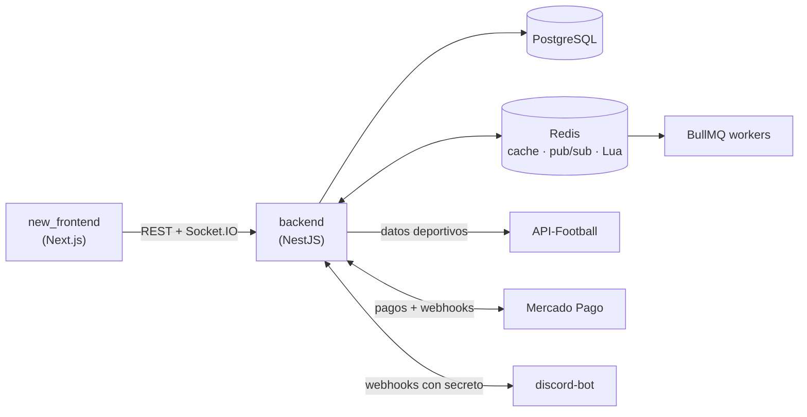

# ChiquiMafias ⚽

**Plataforma de fútbol argentino en tiempo real con comunidad, apuestas virtuales y economía propia.**

[](https://github.com/TorricoFranco/ChiquiMafias/actions/workflows/pipeline.yml)
[](https://github.com/TorricoFranco/ChiquiMafias/actions/workflows/frontend.yml)


<!-- Captura principal: descomentar cuando exista docs/screenshots/home.png
<p align="center">
  
</p>
-->

## ¿Qué es?

La mayoría de las apps de fútbol (Promiedos, Canchallena, etc.) son hojas de cálculo
estáticas: resultados y tablas, y nada más. ChiquiMafias combina esos datos en vivo con
**comunidad**: chat global y por partido, encuestas, apuestas virtuales entre usuarios y
una economía de monedas para destacarse con cosméticos.

Está pensada para dos perfiles: el **hincha que consume datos** (resultados, formaciones,
estadísticas y tabla de la liga argentina en tiempo real) y el **miembro de la
comunidad**, que chatea, vota, apuesta y personaliza su perfil.

## Funcionalidades

- **Partidos en vivo**: marcador, eventos, formaciones y estadísticas que se actualizan
  solos por WebSocket.
- **Tabla y fixture** de la liga argentina.
- **Chat** global y una sala por partido, con stickers, mensajes fijados ("megáfono")
  y moderación en tiempo real.
- **Apuestas virtuales pari-mutuel**: el pozo se reparte entre los que acertaron, con
  las cuotas actualizándose en vivo.
- **Encuestas** creadas por la comunidad.
- **Economía de monedas**: racha diaria, tienda de cosméticos (banners, colores de
  nombre, burbujas de chat) y packs de monedas.
- **Suscripciones** con Mercado Pago: tres tiers, upgrades con prorrateo y período de
  gracia.
- **Soporte y moderación desde Discord**: los tickets y reportes se gestionan con
  botones y comandos en un servidor de Discord, sin panel web.

<!-- Galería: descomentar cuando estén las capturas en docs/screenshots/
| | |
|---|---|
|  |  |
| **Partido en vivo** | **Apuestas pari-mutuel** |
|  |  |
| **Chat por partido** | **Tienda de cosméticos** |
|  |  |
| **Perfil y racha** | **Soporte desde Discord** |
-->

## Stack

| App | Tecnologías |
|---|---|
| **Backend** (`backend/`) | NestJS 11, Prisma 6 + PostgreSQL 15, Redis 7, BullMQ, Socket.IO, JWT + Google OAuth, Swagger |
| **Frontend** (`new_frontend/`) | Next.js 16 (App Router), React 19, TanStack Query, Zustand, Tailwind CSS 4, socket.io-client |
| **Bot** (`discord-bot/`) | Express 5, discord.js 14 |
| **Integraciones** | API-Football, Mercado Pago, Cloudinary, Resend |
| **Infra y calidad** | Docker Compose, GitHub Actions, Jest, Supertest, Playwright |

## Arquitectura



El backend es la única fuente de verdad. Los crons traen los datos de API-Football y
los publican en Redis, y los gateways de Socket.IO los re-emiten a los clientes. El
detalle completo está en **[docs/ARCHITECTURE.md](docs/ARCHITECTURE.md)**.

### Highlights técnicos

- **Apuestas atómicas en Redis con Lua** y persistencia diferida con BullMQ
  (write-behind): respuesta en milisegundos aunque lleguen cientos de apuestas en el
  último minuto. → [detalle](docs/ARCHITECTURE.md#apuestas-de-alta-concurrencia-con-lua-y-write-behind)
- **Wallet sin doble gasto** con updates condicionales y locks optimistas dentro de
  transacciones. → [detalle](docs/ARCHITECTURE.md#consistencia-financiera-sin-doble-gasto)
- **Webhooks de pago idempotentes**: una unique constraint garantiza que un pago
  reintentado no acredite dos veces. → [detalle](docs/ARCHITECTURE.md#webhooks-idempotentes-de-mercado-pago)
- **Tiempo real desacoplado** con pub/sub de Redis entre la ingesta y los gateways.
  → [detalle](docs/ARCHITECTURE.md#tiempo-real-desacoplado-con-redis-pubsub)
- **Cache-aside** para no agotar la cuota de API-Football y tolerar sus caídas.
  → [detalle](docs/ARCHITECTURE.md#cache-aside-frente-a-api-football)
- **Backoffice en Discord**: un microservicio aparte con contrato de webhooks
  autenticado en los dos sentidos. → [detalle](docs/ARCHITECTURE.md#backoffice-en-discord)

## Cómo levantarlo

Requisitos: Docker y Docker Compose v2.

```bash
git clone https://github.com/TorricoFranco/ChiquiMafias.git
cd ChiquiMafias
cp .env.example .env.dev   # completar credenciales

docker compose --env-file .env.dev -f docker-compose.dev.yml up -d postgres redis
docker compose --env-file .env.dev -f docker-compose.dev.yml run --rm backend npx prisma migrate deploy
docker compose --env-file .env.dev -f docker-compose.dev.yml up
```

Web en <http://localhost:3005> y Swagger en <http://localhost:3007/api>.

Las credenciales necesarias, cómo correr las apps sin Docker, los datos iniciales y los
problemas comunes están en **[docs/SETUP.md](docs/SETUP.md)**.

## Estructura del monorepo

| Carpeta | Qué es |
|---|---|
| [`backend/`](backend/) | API REST + WebSockets, crons y colas |
| [`new_frontend/`](new_frontend/) | Aplicación web (frontend activo) |
| [`discord-bot/`](discord-bot/) | Microservicio de soporte y moderación |
| [`docs/`](docs/) | Arquitectura, instalación y capturas |
| `frontend/` | Versión anterior del frontend. **Legacy**: se conserva solo como referencia |
| `.claude/` | Configuración del desarrollo asistido por IA (ver abajo) |

## Tests y CI

- **Backend**: unit tests con Jest de la lógica crítica (liquidación de mercados,
  idempotencia de webhooks y rachas) y e2e con Supertest contra Postgres y Redis
  reales. CI: [`pipeline.yml`](.github/workflows/pipeline.yml) en cada push o PR a
  `main`.
- **Frontend**: suite e2e de Playwright con la API y los sockets mockeados, en desktop
  y mobile, contra el build de producción. CI: [`frontend.yml`](.github/workflows/frontend.yml)
  en cada push o PR a `develop` y `main`.

## Desarrollo asistido por IA

El proyecto se desarrolla con [Claude Code](https://claude.com/claude-code). En
`.claude/` están las reglas por zona del código, las skills (scaffolding de módulos,
verificación y cierre de PRs) y subagentes revisores especializados en dinero y
concurrencia, en el frontend y en el contrato entre apps.

## Licencia

© 2026 Franco Torrico. Todos los derechos reservados: el código es visible con fines de
portfolio, pero no está licenciado para uso, copia ni redistribución. Ver
[LICENSE](LICENSE).
