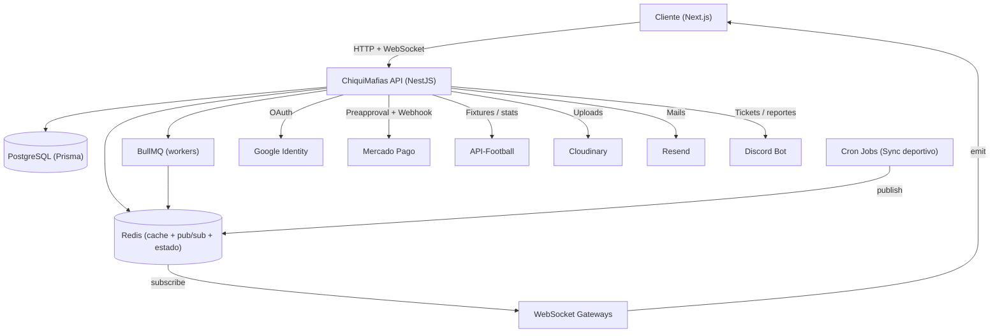
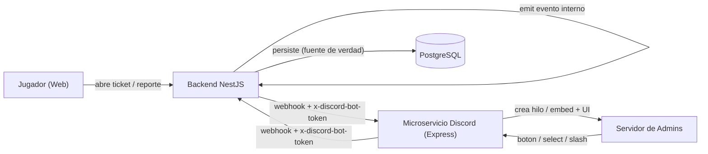
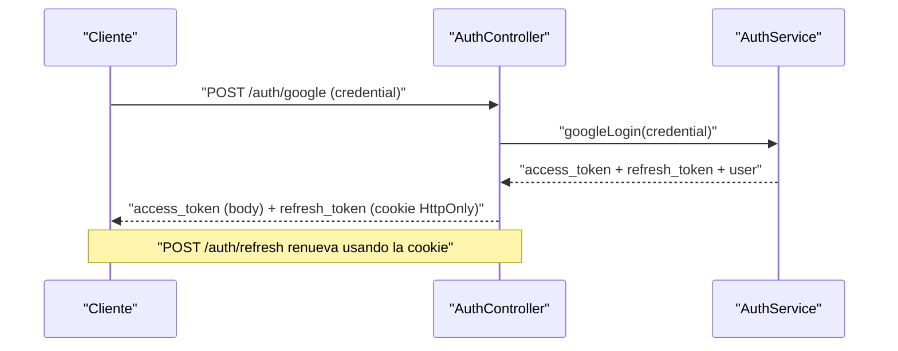
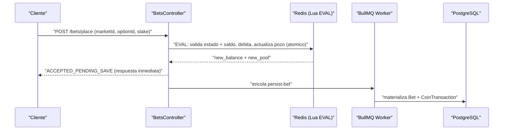
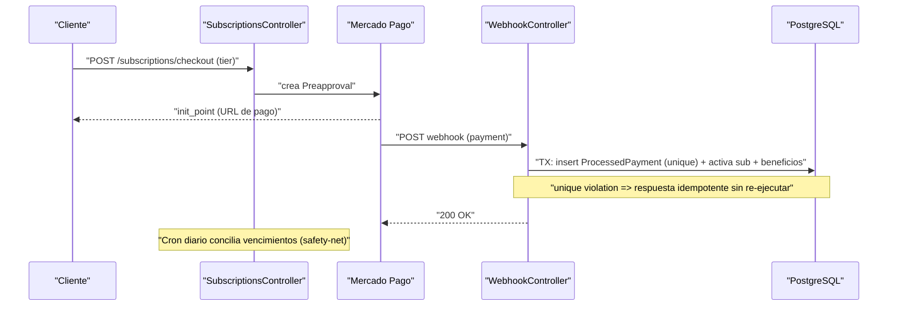

# ChiquiMafias — Backend Engineering Overview ⚽  
  
Backend de alto rendimiento para **ChiquiMafias**, una plataforma que revoluciona el  
consumo de datos de fútbol combinando estadísticas en tiempo real con dinámicas de  
gamificación, apuestas y economía virtual.  
Construido sobre **NestJS** bajo una arquitectura orientada a eventos, diseñado  
específicamente para resolver problemas de producción reales: **alta concurrencia,  
resiliencia de datos financieros y latencia cero mediante WebSockets**.  
  
Este documento está pensado para lectura técnica: describe las decisiones de  
arquitectura, los patrones de ingeniería aplicados y los subsistemas de mayor  
complejidad. La referencia de endpoints se encuentra autodocumentada vía Swagger.  
  
> Documentación interactiva de la API disponible en `/api` (OpenAPI / Swagger).  
  
## 🎯 La Visión de ChiquiMafias  
  
La mayoría de las aplicaciones de fútbol (como Promedios, Canchallena, etc) funcionan  
como simples hojas de cálculo estáticas. ChiquiMafias nace para romper con ese  
modelo, creando un ecosistema que retiene tanto al usuario casual como al hincha más  
involucrado, combinando información deportiva dura con un fuerte **sentido de comunidad**.  
  
### El producto está diseñado con dos perfiles en mente:  
  
- **El Consumidor de Datos:** Accede a estadísticas en tiempo real, resultados,  
  formaciones y tablas de posiciones (enfocado actualmente en la liga argentina).  
- **El Miembro de la Comunidad:** Interactúa en chats globales o en salas generadas  
  dinámicamente por cada partido en vivo, participa en encuestas de usuarios, realiza  
  apuestas virtuales y utiliza una economía de "consumibles" (fijar mensajes, usar  
  stickers exclusivos) para destacarse.  
  
---  
  
## 🧱 Stack tecnológico  
  
| Área | Tecnología |  
|------|-----------|  
| Framework | NestJS 11 (TypeScript) |  
| Persistencia | PostgreSQL + Prisma ORM 6 |  
| Cache / Estado efímero / Pub-Sub | Redis (ioredis) |  
| Colas / Workers | BullMQ |  
| Tiempo real | Socket.IO (WebSocket Gateways) |  
| Tareas programadas | @nestjs/schedule (cron) |  
| Autenticación | JWT (access + refresh) + Google OAuth |  
| Pagos / Suscripciones | Mercado Pago (Preapproval + Webhooks) |  
| Datos deportivos | API-Football |  
| Media | Cloudinary |  
| Email transaccional | Resend |  
| Integración externa | Discord bot |  
| Documentación | Swagger (@nestjs/swagger) |  
| Testing | Jest + Supertest + Testcontainers |  
  
---  
  
## 🏗️ Arquitectura  
  

  
La aplicación agrupa ~25 módulos de dominio. Toda request atraviesa tres **guards  
globales**: `ThrottlerGuard` (rate limiting), `JwtAuthGuard` (autenticación) y  
`UserStatusGuard` (revocación de acceso para usuarios baneados), reforzados por  
`helmet`, CORS con credenciales, cookies HttpOnly y un `ValidationPipe` con  
whitelist estricta.  
  
---  
  
## 🚀 Desafíos Resueltos y Patrones Aplicados  
  
### ⚡ Procesamiento de Apuestas de Alta Concurrencia (Lua + Write-Behind)  
Para evitar que una avalancha de apuestas en el último minuto bloquee el servidor,  
la validación y el débito de monedas ocurren **atómicamente en la memoria de Redis  
mediante Scripts Lua**. La persistencia en PostgreSQL se difiere a **workers en  
background (BullMQ)**, logrando respuestas en milisegundos sin asfixiar la base de datos.  
  
### 💸 Consistencia Financiera y Prevención de Doble Gasto (ACID)  
Las operaciones de la Wallet delegan el control de concurrencia al motor de PostgreSQL  
mediante **actualizaciones condicionales**, eliminando race conditions. La liquidación  
de premios utiliza **locks optimistas** envueltos en **transacciones atómicas de Prisma**  
para garantizar que ningún premio se pague dos veces.  
  
### 🛡️ Idempotencia Estricta en Webhooks (Mercado Pago)  
Para tolerar reintentos de red y fallos de la pasarela de pagos sin duplicar beneficios  
o suscripciones, el procesamiento es **idempotente por diseño**. Una **restricción de  
unicidad (unique constraint)** en la base de datos asegura que la activación del pago y  
la entrega de monedas ocurran en una **única transacción a prueba de fallos**.  
  
### 📡 Desacoplamiento en Tiempo Real (Pub/Sub)  
La ingesta de datos deportivos (cron jobs) y la entrega a los usuarios (WebSockets) están  
totalmente aisladas mediante un **patrón Pub/Sub en Redis**. Esto permite escalar los  
Gateways de chat y partidos en vivo **horizontalmente** sin sobrecargar la lógica de negocio.  
  
### ⏱️ Reducción de Latencia y Costos (Cache-Aside)  
Para no agotar la cuota de la API-Football externa y servir datos instantáneos, se  
implementó una estrategia de **lazy-loading en Redis** con **invalidación activa** y  
**reconciliación de datos**, tolerando caídas del proveedor original.  
  
### 🔁 Resiliencia ante Servicios Externos  
Las llamadas a Mercado Pago usan **retry con backoff exponencial** (reintenta solo ante  
fallos transitorios 5xx/red, corta ante 4xx). El pipeline de sincronización deportiva  
(cron) suma **retry-logic** para que los estados de los partidos se reflejen en tiempo  
real en los clientes vía WebSockets, con **reconciliación** como red de seguridad.  
  
### 🔗 Desacoplamiento Intra-Proceso (Event Emitter)  
Los eventos internos se propagan con `@nestjs/event-emitter` (p. ej. `report.resolved`  
→ mute automático), desacoplando moderación/soporte del módulo de chat.  
  
---  
  
## 🧩 Módulos centrales  
  
### ⚽ BetsModule — Apuestas *pari-mutuel* como máquina de estados asíncrona  
  
Modela un **mercado con ciclo de vida** gobernado por una máquina de estados:  
`OPEN → LOCKED → SETTLED | REFUNDED`, orquestada por procesos asíncronos independientes:  
  
- **Ingesta (in-memory):** colocación **atómica vía Lua** en Redis.  
- **Persistencia (async):** worker **BullMQ** que materializa la apuesta en DB.  
- **Cierre (cron):** job por minuto que transiciona `OPEN → LOCKED` y notifica por WebSocket.  
- **Liquidación (transacción):** cálculo del **multiplicador pari-mutuel**, pago a  
  ganadores, **reembolso automático** ante mercados desiertos, todo bajo **lock optimista**.  
  
El desafío central: mantener **consistencia eventual** entre tres fuentes de verdad  
(Redis, PostgreSQL y clientes WebSocket) sin bloquear el hot-path.  
  
### 🎫 SubscriptionsModule (SaaS)  
  
Modela la suscripción como una **máquina de estados tolerante a fallos**  
(`ACTIVE`, `GRACE_PERIOD`, `EXPIRED`).  
  
- **Grace Period:** lógica **estilo Spotify** (48h de tolerancia ante fallos de cobro).  
- **Upgrades Dinámicos:** calcula en tiempo real el **prorrateo** de días restantes y  
  los convierte en **bonus coins** al cambiar de plan, en una **única transacción atómica**.  
- **Conciliación (Safety-net):** cron jobs diarios barren la base de datos para degradar  
  suscripciones y revocar beneficios cosméticos si un webhook de Mercado Pago jamás llegó.  
  
### 🔥 Mecánicas de retención (Engagement Loops)  
  
- **Daily Login Streak:** racha de conexión diaria con recompensa que **crece  
  exponencialmente**, **multiplicadores por tier** y **regalos cosméticos** en hitos  
  (día 10, 20, 30).  
- **Economía diaria:** monedas de regalo inicial, premios por racha, descuentos  
  programados en tienda y promociones de fin de mes.  
  
### 💬 ChatModule — Tiempo real, moderación y cosméticos  
  
No es un chat simple: **chat global y por partido**, historial en Redis, **stickers**  
comprables, **mensajes fijados** vía "megáfono" (Redis con TTL), **rate limiting** por  
usuario, y **moderación**: los mods pueden **eliminar mensajes** y aplicar **timeout/mute  
global** que silencia al usuario en todos los chats a la vez (Redis TTL + evento WebSocket).  
  
### 👾 Backoffice Descentralizado (Microservicio de Discord)  
  
¿Para qué obligar a los administradores a loguearse en un panel web si ya pasan  
el día en Discord? El sistema de soporte y moderación no tiene panel tradicional:  
opera íntegramente a través de un **microservicio de Discord independiente**  
(contenedor propio), comunicado con el backend NestJS mediante un contrato de  
webhooks.  
  
- **🎫 Gestión de Tickets Omnicanal:** cuando un jugador abre un reporte en la  
  web, el backend emite un evento de dominio y el bot **crea automáticamente un  
  hilo privado** en el servidor de administradores. Los admins chatean, resuelven  
  y cambian estados mediante **menús y botones interactivos (UI de Discord)**, y  
  la plataforma web se actualiza al instante.  
- **🔄 Sincronización Bidireccional (Event-Driven):** las acciones en Discord  
  (botones, select menus, slash commands `/soporte`) consumen los webhooks de  
  NestJS; a la inversa, los eventos internos del backend (`@nestjs/event-emitter`)  
  disparan las alertas al bot. **PostgreSQL se mantiene como la única fuente de  
  verdad.**  
- **🛡️ Comunicación Inter-Servicios Segura:** al estar divididos en dos  
  contenedores, ambos servicios se blindan con **validación de cabecera segura  
  (`x-discord-bot-token`) mediante un secreto interno compartido**, verificado en  
  ambas direcciones, evitando que un actor externo simule ser el bot para aprobar  
  tickets o aplicar sanciones.  
  



---  
  
## 🔄 Flujos clave  
  
### Autenticación (Google + JWT)  
  

  
### Colocación de apuesta (Lua + Write-Behind)  
  

  
### Suscripciones + webhook idempotente  
  

  
---  
  
## 📡 API Reference  
  
La API expone su superficie completa a través de **Swagger/OpenAPI en `/api`**,  
con esquemas de request/response, DTOs validados y requisitos de autenticación  
por endpoint. Los dominios cubiertos incluyen `auth`, `users`, `wallet`, `bets`,  
`store`, `inventory`, `subscriptions`, `streaks`, `standings`, `fixture`,  
`matches`, `teams`, `polls`, `notifications`, `support`, `moderation`, `chat`  
(WebSocket) y `webhook`. Se recomienda levantar el servidor y explorar `/api`  
para el detalle actualizado en lugar de mantener una tabla estática.  
  
---  
  
## 🧪 Testing  
  
```bash  
npm run test        # unit + e2e  
npm run test:unit   # solo *.spec.ts  
npm run test:e2e    # e2e (config test/jest-e2e.json)  
npm run test:cov    # coverage  
```  
  
La suite cubre lógica de negocio crítica con tests unitarios (liquidación de  
mercados, idempotencia y resiliencia de webhooks, cálculo de rachas) y tests  
e2e que corren contra una base de datos real vía Testcontainers / Docker  
Compose, sincronizada con `prisma db push` antes de ejecutar.  
  
---  
  
## 📁 Estructura  
  
```  
backend/  
├── src/  
│   ├── auth/            # Google OAuth, JWT, guards, roles  
│   ├── users/           # perfiles, roles, moderación (timeout/ban)  
│   ├── wallet/          # saldo y transacciones (updates condicionales)  
│   ├── bets/            # mercados pari-mutuel (Lua + BullMQ + crons)  
│   ├── store/           # tienda de ítems y descuentos  
│   ├── inventory/       # inventario de usuario  
│   ├── subscriptions/   # planes + Mercado Pago + streaks (incluye /docs)  
│   ├── streaks/         # rachas diarias (engagement loop)  
│   ├── webhook/         # webhook de pagos  
│   ├── chat/            # chat global/partido, stickers, moderación  
│   ├── notifications/   # notificaciones y anuncios  
│   ├── support/         # tickets y reportes  
│   ├── polls/           # encuestas  
│   ├── api-football/    # ingesta deportiva (crons + pub/sub)  
│   ├── standings/, fixture/, matches/, teams/  
│   ├── discord/, cloudinary/, email/, mercado-pago/  
│   ├── redis/, prisma/  # infraestructura (pub/sub, ORM)  
│   ├── adapters/        # SocketIoAdapter  
│   ├── config/          # validación de env (Joi)  
│   └── main.ts  
├── prisma/schema.prisma  
└── test/                # tests e2e  
```  
  
---  
  
## ⚙️ Setup local  
  
### Requisitos  
- Node.js 20+  
- Docker y Docker Compose (PostgreSQL + Redis)  
  
### Pasos  
  
```bash  
# 1. Instalar  
cd backend  
npm install  
  
# 2. Variables de entorno  
cp .env.example .env   # completar valores  
  
# 3. Dependencias (Postgres + Redis) desde la raíz del repo  
docker compose up -d postgres redis  
  
# 4. Prisma  
npx prisma generate  
npx prisma db push  
  
# 5. Desarrollo  
npm run start:dev  
```  
  
La API queda en `http://localhost:3007` y Swagger en `http://localhost:3007/api`.  
El stack completo (backend + frontend + discord-bot + ngrok) se levanta con  
`docker compose up` desde la raíz.  
  
### Variables de entorno  
  
| Variable | Descripción | Default |  
|----------|-------------|---------|  
| `NODE_ENV` | Entorno de ejecución | `development` |  
| `PORT` | Puerto HTTP | `3007` |  
| `HOST` | Host de bind | `0.0.0.0` |  
| `CLIENT_URL` | Origen permitido por CORS | — |  
| `ID_LEAGUE_ARG` | ID de liga en API-Football | 128 |  
| `DATABASE_URL` | Conexión PostgreSQL | — |  
| `API_FOOTBALL_KEY` | API key de API-Football | — |  
| `GOOGLE_CLIENT_ID` | Client ID de Google OAuth | — |  
| `JWT_ACCESS_SECRET` | Secreto del access token | — |  
| `JWT_ACCESS_EXPIRES_IN` | TTL access token | `15m` |  
| `JWT_REFRESH_SECRET` | Secreto del refresh token | — |  
| `JWT_REFRESH_EXPIRES_IN` | TTL refresh token | `7d` |  
| `BCRYPT_SALT_ROUNDS` | Rondas de bcrypt | `12` |  
| `FRONTEND_SUCCESS_URL` | Redirect pago exitoso | — |  
| `FRONTEND_FAILURE_URL` | Redirect pago fallido | — |  
| `FRONTEND_PENDING_URL` | Redirect pago pendiente | — |  
| `FRONTEND_URL` | URL del frontend | — |  
| `MERCADO_PAGO_API_URL` | Base URL de Mercado Pago | — |  
| `MERCADO_PAGO_ACCESS_TOKEN` | Access token de MP | — |  
| `MERCADO_PAGO_RECEIVER_ID` | Receiver ID (opcional) | — |  
| `MERCADO_PAGO_WEBHOOK_URL` | URL pública del webhook | — |  
| `MERCADO_PAGO_WEBHOOK_SECRET` | Secreto para validar firma | — |  
| `CLOUDINARY_CLOUD_NAME` | Cloud name | — |  
| `CLOUDINARY_API_KEY` | API key | — |  
| `CLOUDINARY_API_SECRET` | API secret | — |  
| `RESEND_API_KEY` | API key de Resend | — |  
| `DISCORD_INTERNAL_SECRET` | Secreto interno backend↔bot | — |  
| `DISCORD_BOT_URL` | URL del bot de Discord | — |  
| `REDIS_HOST` | Host de Redis | `redis` |  
| `REDIS_PORT` | Puerto de Redis | `6379` |  
| `REDIS_PASSWORD` | Password de Redis | — |