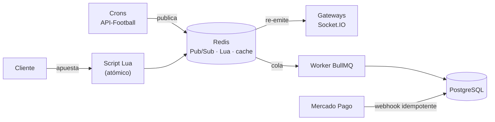

# ChiquiMafias — Backend ⚙️

**El motor de [ChiquiMafias](../README.md): datos de fútbol en vivo, apuestas con plata virtual y pagos reales, todo aguantando concurrencia.**


## 🧠 Lo que lo hace distinto

No es un CRUD con login. Maneja **dinero (virtual y real), tiempo real y servicios externos que fallan**, y está resuelto como en un producto de verdad:

| | Problema real | Cómo se resolvió |
|---|---|---|
| ⚡ | Cientos de apuestas en el último minuto antes del partido | Validación y débito **atómicos en Redis con scripts Lua**; la base se actualiza después con **workers de BullMQ** (*write-behind*). Respuesta en milisegundos. |
| 💰 | Que nadie gaste dos veces la misma moneda ni cobre dos veces un premio | **Updates condicionales** (`WHERE balance >= monto`) y **locks optimistas** dentro de transacciones: la base de datos es el árbitro, no el código. |
| 🔁 | Mercado Pago reenvía los webhooks | **Idempotencia por diseño**: una *unique constraint* sobre el ID del pago garantiza que un reintento jamás acredite dos veces. |
| 📡 | Datos en vivo sin acoplar ingesta y usuarios | Los crons publican en **Redis Pub/Sub** y los gateways de Socket.IO re-emiten: se puede escalar cada lado por separado. |
| 🛡️ | La API de fútbol tiene cuota y se cae | **Cache-aside** con invalidación activa y reconciliación, más **retry con backoff exponencial** que distingue fallos transitorios (5xx) de errores reales (4xx). |



## 🏭 Patrones de proyectos reales

- **Máquinas de estados** para apuestas (`OPEN → LOCKED → SETTLED | REFUNDED`) y suscripciones (`PENDING → ACTIVE → GRACE_PERIOD → EXPIRED`), movidas por crons y webhooks.
- **Apuestas pari-mutuel**: el pozo se reparte entre los que acertaron, con **reembolso automático** si el mercado queda desierto.
- **Suscripciones tipo Spotify**: cancelás y seguís hasta el fin del ciclo pago, **48 h de gracia** si falla un cobro, **upgrades con prorrateo** devuelto en monedas y un cron de **conciliación** por si un webhook nunca llega.
- **Seguridad en capas**: rate limiting, JWT con refresh en cookie HttpOnly, guard de usuarios baneados, `helmet` y validación estricta de DTOs (un campo de más → 400).
- **Falla rápido**: las variables de entorno se validan con **Joi** al arrancar; si falta una, la app no levanta.
- **Eventos de dominio** (`@nestjs/event-emitter`): moderación y soporte reaccionan sin depender del módulo de chat.
- **Microservicio aparte** (bot de Discord) como backoffice, hablando con el backend por webhooks autenticados en ambos sentidos.

## 📊 En números

| ~30 | 3 | 12+ | 2 |
|:---:|:---:|:---:|:---:|
| módulos de dominio | guards globales en cada request | tareas programadas, de 30 s a 1 h | suites de test: unit + e2e contra Postgres y Redis reales |

## 🧪 Calidad

- **Unit tests** de la lógica crítica: liquidación de mercados, idempotencia de webhooks y rachas.
- **E2E con Supertest** contra Postgres y Redis reales, no mocks.
- **CI en GitHub Actions**: levanta los servicios, migra, compila y corre todo en cada PR a `main`.
- **Swagger** autogenerado desde los DTOs.

Detalle de cada decisión en **[docs/ARCHITECTURE.md](../docs/ARCHITECTURE.md#backend)**.

---

## 🚀 Para correrlo

Instalación y variables de entorno: [docs/SETUP.md](../docs/SETUP.md). Con el server corriendo, la API está documentada en <http://localhost:3007/api>.

```bash
npm run start:dev    # desarrollo con watch (puerto 3007)
npm run build        # compila a dist/
npm run test:unit    # unit tests, seguros de correr siempre
npm run test:e2e     # ⚠️ borra las tablas de la base de DATABASE_URL: usar una DB descartable
npm run seed:e2e     # usuarios de prueba e2e-*@chiquimafias.test
```

> `npm test` corre unit **y** e2e. Para los e2e usá siempre una base descartable, nunca la de desarrollo.

```bash
npx prisma generate         # después de cada install o cambio del schema
npx prisma migrate deploy   # aplica las migraciones
npx prisma studio           # explorar datos
```

## 🗂️ Estructura

Cada dominio vive en `src/<dominio>/` con su module, controller y service, y según el caso un gateway (Socket.IO), un processor (BullMQ), crons y specs.

| Grupo | Módulos |
|---|---|
| Auth y usuarios | `auth`, `users` |
| Dinero | `wallet`, `bets`, `coin-shop`, `store`, `inventory`, `subscriptions`, `webhook` |
| Comunidad | `chat`, `polls`, `notifications`, `support`, `streaks`, `stats` |
| Datos deportivos | `api-football` (crons), `matches`, `fixture`, `standings`, `teams` |
| Integraciones | `mercado-pago`, `discord`, `cloudinary`, `email` |
| Infraestructura | `prisma`, `redis`, `config`, `adapters`, `filters`, `pipes` |

Detalles útiles: sin prefijo global (`/bets/markets`), toda ruta requiere JWT salvo las marcadas con `@Public()`, y el CI está en [`pipeline.yml`](../.github/workflows/pipeline.yml).
