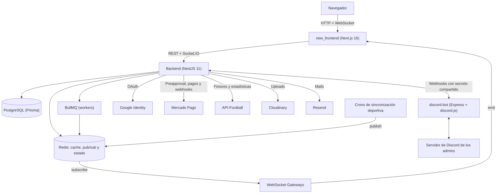
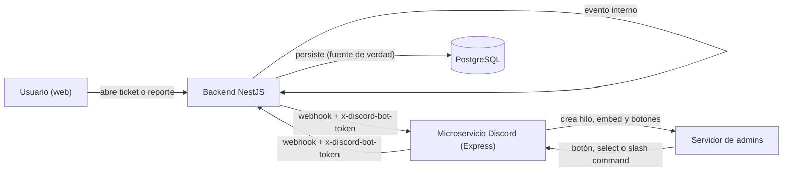
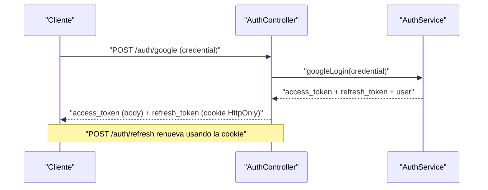
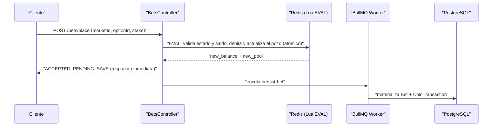
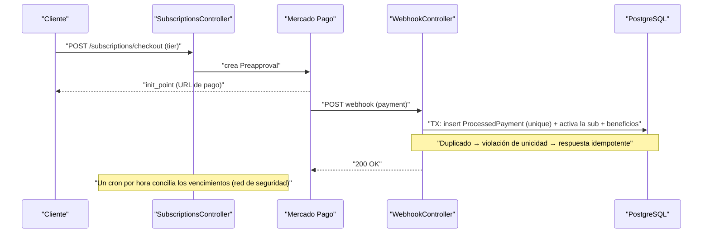

# Arquitectura de ChiquiMafias

Este documento está pensado para lectura técnica. Describe cómo se reparten las
responsabilidades entre las tres apps del monorepo, las decisiones de arquitectura,
los patrones aplicados y los subsistemas más complejos.

Para levantar el proyecto: [SETUP.md](SETUP.md). La referencia de endpoints está
autodocumentada con Swagger en `/api` del backend.

**Contenido**

- [Visión general](#visión-general)
- [Contrato entre apps](#contrato-entre-apps)
- [Backend](#backend)
  - [Desafíos resueltos y patrones aplicados](#desafíos-resueltos-y-patrones-aplicados)
  - [Módulos centrales](#módulos-centrales)
  - [Tareas programadas](#tareas-programadas)
- [Frontend](#frontend)
- [Bot de Discord](#bot-de-discord)
- [Flujos clave](#flujos-clave)

---

## Visión general



| App | Responsabilidad |
|---|---|
| `backend/` | Toda la lógica de negocio y la única fuente de verdad (PostgreSQL). Expone REST + Socket.IO, corre los crons de ingesta deportiva y las colas. |
| `new_frontend/` | Cliente web. No tiene lógica de negocio propia: consume la API, mantiene la cache con TanStack Query y la actualiza con los eventos de socket. |
| `discord-bot/` | Backoffice de soporte y moderación. No guarda estado: todo lo que hace pasa por webhooks del backend. |

---

## Contrato entre apps

- **REST sin prefijo global**: `/bets/markets`, no `/api/bets/markets`. La excepción
  son los webhooks del bot: `/api/discord/webhook/*`.
- **Auth**: login con Google → el backend devuelve el `access_token` en el body (el
  front lo guarda en memoria con Zustand) y el `refresh_token` en una cookie
  HttpOnly. `POST /auth/refresh` renueva el access token usando la cookie.
- **Tiempo real**: Socket.IO con `auth: { token }`. Los crons publican en Redis
  (`match_updates`, `league_live_updates`) y los gateways re-emiten a los clientes.
  Las apuestas usan su propio namespace, `/bets`.
- **Tipos compartidos**: no hay un paquete común. Los tipos del front son copias de
  los DTOs del backend en `new_frontend/features/<dominio>/types/`, y se actualizan en
  el mismo cambio que el DTO.
- **Backend ↔ bot**: toda request, en los dos sentidos, lleva el header
  `x-discord-bot-token` con un secreto interno compartido (`DISCORD_INTERNAL_SECRET`),
  que se valida en ambos lados.

---

## Backend

### Stack

| Área | Tecnología |
|------|-----------|
| Framework | NestJS 11 (TypeScript) |
| Persistencia | PostgreSQL 15 + Prisma ORM 6 |
| Cache, estado efímero y pub/sub | Redis 7 (ioredis) |
| Colas y workers | BullMQ |
| Tiempo real | Socket.IO (WebSocket Gateways) |
| Tareas programadas | @nestjs/schedule (cron) |
| Eventos internos | @nestjs/event-emitter |
| Autenticación | JWT (access + refresh) + Google OAuth |
| Pagos y suscripciones | Mercado Pago (Preapproval + Webhooks) |
| Datos deportivos | API-Football |
| Media | Cloudinary |
| Email transaccional | Resend |
| Documentación | Swagger (@nestjs/swagger) |
| Testing | Jest + Supertest + Testcontainers |

### Pipeline de una request

La aplicación agrupa unos 25 módulos de dominio. Toda request atraviesa tres **guards
globales**: `ThrottlerGuard` (rate limiting), `JwtAuthGuard` (autenticación) y
`UserStatusGuard` (corta el acceso a usuarios baneados). Se suman `helmet`, CORS con
credenciales, cookies HttpOnly y un `ValidationPipe` con whitelist estricta
(`forbidNonWhitelisted`). Las variables de entorno se validan con Joi al arrancar
(`src/config/env.validation.ts`): si falta una, la app no levanta.

### Desafíos resueltos y patrones aplicados

#### Apuestas de alta concurrencia con Lua y write-behind

Para que una avalancha de apuestas en el último minuto no bloquee el servidor, la
validación y el débito de monedas ocurren **atómicamente en Redis mediante scripts
Lua**. La persistencia en PostgreSQL se difiere a **workers de BullMQ**, así que la
respuesta llega en milisegundos sin asfixiar la base de datos.

#### Consistencia financiera sin doble gasto

Las operaciones de la wallet delegan el control de concurrencia al motor de PostgreSQL
mediante **actualizaciones condicionales** (`UPDATE … WHERE balance >= monto`), que
eliminan las race conditions. La liquidación de premios usa **locks optimistas**
dentro de **transacciones de Prisma**, para que ningún premio se pague dos veces.

#### Webhooks idempotentes de Mercado Pago

Mercado Pago reintenta las notificaciones, así que el procesamiento es **idempotente
por diseño**. La tabla `ProcessedPayment` tiene una **unique constraint** sobre el ID
del pago: el insert se hace en la misma transacción que la activación de la
suscripción o la acreditación de monedas. Si llega un duplicado, la violación de
unicidad (`P2002`) corta la transacción y la respuesta es idempotente, sin re-ejecutar
nada. El mismo mecanismo cubre las suscripciones y la compra de packs de monedas.

#### Tiempo real desacoplado con Redis Pub/Sub

La ingesta de datos deportivos (crons) y la entrega a los usuarios (WebSockets) están
aisladas con un **patrón pub/sub en Redis**. Eso permite escalar los gateways de chat y
partidos en vivo **horizontalmente** sin tocar la lógica de negocio.

#### Cache-aside frente a API-Football

Para no agotar la cuota de API-Football y servir datos al instante, hay una estrategia
de **lazy-loading en Redis** con **invalidación activa** y **reconciliación de datos**,
que tolera caídas del proveedor.

#### Resiliencia ante servicios externos

Las llamadas a Mercado Pago usan **retry con backoff exponencial**: reintentan solo
ante fallos transitorios (5xx o red) y cortan ante un 4xx. El pipeline de
sincronización deportiva suma su propia lógica de reintentos, con
**reconciliación** como red de seguridad.

#### Desacoplamiento intra-proceso con eventos

Los eventos internos se propagan con `@nestjs/event-emitter` (por ejemplo,
`report.resolved` → mute automático). Así, moderación y soporte no dependen del módulo
de chat.

### Módulos centrales

#### Bets: apuestas pari-mutuel como máquina de estados asíncrona

Cada mercado tiene un ciclo de vida gobernado por una máquina de estados,
`OPEN → LOCKED → SETTLED | REFUNDED`, que mueven procesos asíncronos independientes:

- **Ingesta (en memoria):** la apuesta se coloca **atómicamente con Lua** en Redis.
- **Persistencia (async):** un worker de **BullMQ** la materializa en la DB.
- **Cierre (cron):** un job por minuto pasa los mercados de `OPEN` a `LOCKED` con un
  update condicional (no pisa uno ya liquidado) y avisa por WebSocket.
- **Liquidación (transacción):** calcula el **multiplicador pari-mutuel**, paga a los
  ganadores y hace el **reembolso automático** si el mercado quedó desierto, todo bajo
  **lock optimista**. Los mercados automáticos se liquidan cada 15 minutos con el
  resultado que `LiveScoreCron` guarda en `Matches` (sin llamar a API-Football). El 1X2
  es a los 90': si el partido se definió en el alargue o por penales, gana el Empate. Si
  el partido se posterga, se cancela o se abandona, se reembolsa.

El desafío central es mantener la **consistencia eventual** entre tres fuentes
(Redis, PostgreSQL y los clientes WebSocket) sin bloquear el camino caliente.

#### Subscriptions: suscripciones recurrentes con Mercado Pago

La suscripción es una **máquina de estados tolerante a fallos**:
`PENDING → ACTIVE → CANCELLATION_PENDING | GRACE_PERIOD → EXPIRED`. Si el cobro se
regulariza durante el grace period, vuelve a `ACTIVE`.

- **Tres tiers** (`TIER_1`, `TIER_2`, `TIER_3`) con ciclo de 30 días y cobro
  recurrente vía Preapproval de Mercado Pago.
- **Precios dinámicos:** 10 % de descuento el fin de semana, 15 % los domingos para
  VIP y 25 % en upgrades de domingo (`constants/subscription.constants.ts`).
- **Cancelación estilo Spotify:** al cancelar, los beneficios siguen hasta el fin del
  ciclo pago (`CANCELLATION_PENDING`).
- **Grace period:** si falla un cobro, la suscripción pasa a `GRACE_PERIOD` con 48 h
  de tolerancia antes de vencer.
- **Upgrades con prorrateo:** al subir de tier, los días que quedaban del plan anterior
  se devuelven como **monedas bonus**, en la misma transacción que el alta del nuevo
  plan.
- **Regalos de alta:** cada tier entrega cosméticos (y monedas en los tiers 2 y 3) solo
  al darse de alta, no en cada renovación.
- **Conciliación (red de seguridad):** un cron **cada hora** barre las suscripciones
  vencidas y revoca los beneficios por si un webhook de Mercado Pago nunca llegó.

#### Coin shop y economía de monedas

Las monedas virtuales se compran en packs con pago único de Mercado Pago (módulo
`coin-shop`), con la misma idempotencia que las suscripciones. Se gastan en la
tienda de ítems (`store`): packs de stickers, banners, colores de nombre y burbujas de
chat (permanentes), y megáfonos y tickets para crear encuestas (consumibles). Lo comprado queda en el inventario del
usuario (`inventory`).

#### Mecánicas de retención

- **Racha diaria:** recompensa por conectarse todos los días que **crece**
  con la racha, con **multiplicadores por tier** (x1 FREE hasta x2 en TIER_3) y
  **regalos cosméticos** en hitos (días 5, 7, 10, 15, 20, 25 y 30).
- **Economía diaria:** monedas de regalo inicial, premios por racha, descuentos
  programados en la tienda y promociones de fin de mes.
- **Rankings:** de chat y de rachas, recalculados cada 5 minutos.

#### Chat: tiempo real, moderación y cosméticos

No es un chat simple: hay **chat global y por partido**, historial en Redis,
**stickers** comprables, **mensajes fijados** con el "megáfono" (Redis con TTL),
**rate limiting** por usuario y **moderación**. Los mods pueden **eliminar mensajes** y
aplicar un **timeout o mute global** que silencia al usuario en todos los chats a la
vez (Redis TTL + evento WebSocket).

#### Backoffice en Discord

¿Para qué obligar a los admins a entrar a un panel web si ya pasan el día en Discord?
El soporte y la moderación no tienen panel tradicional: se operan desde un
**microservicio de Discord independiente** (contenedor propio), comunicado con el
backend por un contrato de webhooks.

- **Tickets:** cuando un usuario abre un ticket o un reporte en la web, el backend
  emite un evento de dominio y el bot **crea un hilo privado** en el servidor de los
  admins. Los admins responden, resuelven y cambian estados con **botones, menús y
  modales de Discord**, y la web se actualiza al instante.
- **Sincronización bidireccional:** las acciones en Discord (botones, select menus y el
  slash command `/soporte`) llaman a los webhooks de NestJS. En sentido inverso, los
  eventos internos del backend disparan las alertas al bot. **PostgreSQL sigue siendo
  la única fuente de verdad.**
- **Comunicación inter-servicios segura:** los dos servicios validan el header
  `x-discord-bot-token` con un secreto interno compartido, en ambas direcciones. Así,
  nadie de afuera puede hacerse pasar por el bot para aprobar tickets o aplicar
  sanciones.



### Tareas programadas

| Frecuencia | Job | Qué hace |
|---|---|---|
| 30 s | `liveScoreCron` | Marcadores en vivo → pub/sub → sockets |
| 1 min | `events-fetch`, `prematch-tracker` | Eventos de partido (goles, tarjetas) y partidos por empezar |
| 1 min | `bets-cron` | Cierra los mercados `OPEN → LOCKED` |
| 1 min | `polls/task.service` | Abre y cierra encuestas según su horario |
| 5 min | `polls/task.service` | Vuelca los votos de Redis a PostgreSQL (write-behind) |
| 3 min | `stats-sync` | Estadísticas de partido |
| 5 min | `lineups-fetch` | Formaciones |
| 5 min | `stats/*` | Rankings de chat y de rachas |
| 10 min | `fixtures-sync`, `standings` | Fixture y tabla de posiciones |
| 15 min | `bets-cron` | Liquida los mercados de partidos terminados |
| 30 min | `bets-cron` | Crea mercados automáticamente para los próximos partidos |
| 1 h | `subscriptions.cron` | Conciliación de suscripciones vencidas |

### Estructura

```
backend/
├── src/
│   ├── auth/            # Google OAuth, JWT, guards y roles
│   ├── users/           # perfiles, roles y moderación (timeout y ban)
│   ├── wallet/          # saldo y transacciones (updates condicionales)
│   ├── bets/            # mercados pari-mutuel (Lua + BullMQ + crons)
│   ├── coin-shop/       # compra de packs de monedas con Mercado Pago
│   ├── store/           # tienda de ítems y descuentos
│   ├── inventory/       # inventario del usuario
│   ├── subscriptions/   # planes, Mercado Pago Preapproval y conciliación
│   ├── streaks/         # rachas diarias
│   ├── stats/           # estadísticas de usuario y leaderboards
│   ├── webhook/         # webhook de pagos
│   ├── chat/            # chat global y por partido, stickers, moderación
│   ├── notifications/   # notificaciones y anuncios
│   ├── support/         # tickets y reportes
│   ├── polls/           # encuestas
│   ├── api-football/    # ingesta deportiva (crons + pub/sub)
│   ├── standings/, fixture/, matches/, teams/
│   ├── discord/, cloudinary/, email/, mercado-pago/   # integraciones
│   ├── redis/, prisma/  # infraestructura (pub/sub, ORM)
│   ├── adapters/        # SocketIoAdapter
│   ├── filters/, pipes/ # manejo de errores y validación
│   ├── config/          # validación de variables de entorno (Joi)
│   └── main.ts
├── prisma/              # schema.prisma y migraciones
└── test/                # tests e2e
```

---

## Frontend

`new_frontend/` es una app de **Next.js 16 (App Router) + React 19** en TypeScript.

| Área | Tecnología |
|---|---|
| Datos remotos | TanStack Query 5 |
| Estado global | Zustand (`store/useUserStore.ts` guarda el access token en memoria) |
| Estilos | Tailwind CSS 4 configurado en CSS (`@theme` en `app/globals.css`) |
| Tiempo real | socket.io-client |
| UI | framer-motion, sonner, lucide-react |
| Tests | Playwright (suite mockeada, desktop y mobile) |

**Organización por dominio.** Todo lo de un dominio vive junto en
`features/<dominio>/`:

```
features/bets/
├── api/        # betsApi.ts: funciones async sobre apiFetch
├── hooks/      # useQuery / useMutation sobre la api
├── components/ # UI del dominio
├── types/      # copia de los DTOs del backend
└── socket/     # eventos de Socket.IO que actualizan la cache de Query
```

Hay más de 20 dominios: `bets`, `chat`, `matches`, `standings`, `fixture`, `polls`,
`store`, `coins-shop`, `inventory`, `subscriptions`, `streak`, `wallet`, `profile`,
`moderation`, `supports`, `admin`, entre otros.

**Decisiones relevantes:**

- **Sesión:** `lib/apiFetch.ts` agrega el Bearer, manda las cookies y, si recibe un
  401, refresca el token una sola vez y reintenta. El refresh se coordina entre
  pestañas con la Web Locks API (`navigator.locks`): dos refreshes simultáneos
  rotarían la cookie dos veces y cerrarían la sesión.
- **Sockets:** un socket compartido (`context/SocketContext.tsx`) para el namespace
  raíz (chat, partidos, encuestas y fixture), y una conexión aparte para `/bets`. Los
  eventos actualizan la cache de TanStack Query en lugar de duplicar estado.
- **Rutas:** `app/match/[id]` es el detalle de partido, y `app/@modal/(.)match` lo
  intercepta como modal (parallel + intercepting routes): navegando desde la home se
  abre encima de la página, y con la URL directa se ve como página completa.
- **Diseño:** sistema propio "Estadio Digital", documentado en
  [`new_frontend/DESIGN.md`](../new_frontend/DESIGN.md).
- **Tests:** la suite e2e de Playwright mockea la API en modo estricto (una request
  sin mock hace fallar el test) y emula Socket.IO con `page.routeWebSocket`, así que
  corre en CI sin backend.

---

## Bot de Discord

`discord-bot/` es un servicio **Express 5 + discord.js 14** en JavaScript plano.
Detalle de rutas, interacciones y variables en
[`discord-bot/README.md`](../discord-bot/README.md).

| Dirección | Rutas |
|---|---|
| Backend → bot | `POST /api/alerts/report`, `POST /api/tickets/new`, `POST /api/tickets/forward-message` |
| Bot → backend | `/api/discord/webhook/*` (`action`, `ticket/message`, `ticket/status`, `tickets`, `reports`) |

---

## Flujos clave

### Autenticación (Google + JWT)



### Colocación de apuesta (Lua + write-behind)



### Suscripción + webhook idempotente


